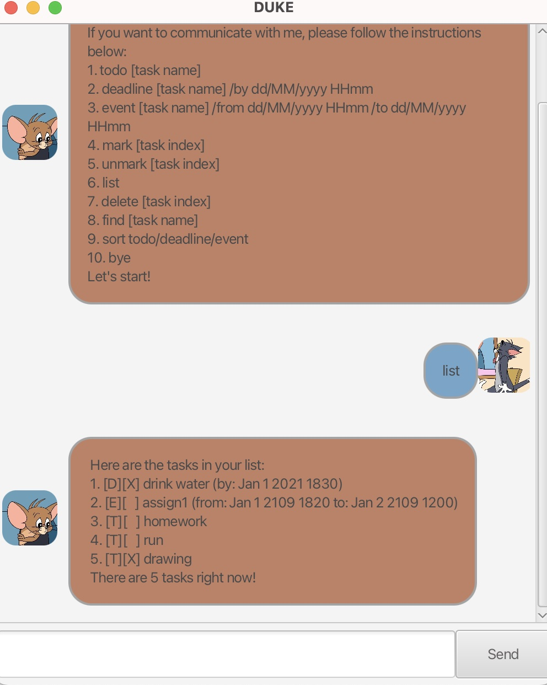

# Duke
## User Guide
Duke **is a chatbot designed to help you easily record and manage your daily tasks.**

### - Quick start
### - Features
+ **todo**
+ **deadline**
+ **event**
+ **list**
+ **mark**
+ **unmark**
+ **delete**
+ **find**
+ **sort**
+ **bye**
### - GUI special improvement


## Quick start
+ Ensure you have Java 11 in your computer.
+ Download the latest DUKE.jar [here](https://github.com/OliviaJHL/ip/releases/tag/A-Release).
+ Put DUKE.jar inside a folder.
+ Right-click on the folder and open the terminal.
+ Type command **java -jar myIP.jar**.
+ A GUI similar to the below should appear in a fel seconds.
  


## Features

### `todo`
To add a todo task in Duke, simply type in the command "todo" followed by the task description.

**Format:** `todo + [task name]`

**Example:** `todo play`

**Sample result:**
```
Got it! I've added this task:
[T][ ] play
Now you have 1 tasks in the list!
```


---
### `deadline`
To add a task with deadline in Duke, simply type in the command "deadline" followed by the task description and deadline.

**Format:** `deadline + [task name] + /by + dd/MM/yyyy HHmm`

**Example:** `deadline homework /by 01/01/2019 1830`

**Sample result:**
```
Got it! I've added this task:
[D][ ] homework (by: Jan 1 2019 1830)
Now you have 1 tasks in the list!
```

---
### `event`
To add an evernt with start and end dates in Duke, simply type in the command "event" followed by the task description, start date and end date.

**Format:** `event + [task name] + /from + dd/MM/yyyy HHmm + /to + dd/MM/yyyy HHmm`

**Example:** `event assign1 /from 01/01/2023 0900 /to 01/01/2023 1200`

**Sample result:**
```
Got it! I've added this task:
[E][ ] assign1 (from: Jan 1 2023 0900 to: Jan 1 2023 1200)
Now you have 1 tasks in the list!
```
---
### `list`
To display all the tasks that you have recorded in Duke, simply use the "list" command.

**Format:** `list`

**Sample result:**
```
1.[T][ ] play
2.[D][ ] home (by:Jan 1 2019 18:30pm)
3.[E][ ] assign1 (from:Jan 1 2023 09:00 to:Jan 1 2023 12:00)
```

---
### `mark`
To mark a task as done, simply type in the command "mark" followed by the task index number.

**Format:** `mark + [task number]`

**Example of usage:** `mark 1`

**Expected result:**
```
Nice! I've marked this task as done:
1.[T][X] play
```

---
### `unmark`
To mark a task as undone, simply type in the command "unmark" followed by the task index number.

**Format:** `unmark + [task number]`

**Example:** `unmark 1`

**Expected result:**
```
Nice! I've marked this task as undone:
1.[T][ ] play
```

---
### `delete`
To delete a task, simply type in the command "delete" followed by the task index number.

**Format:** `delete + [task number]`

**Example:** `delete 1`

**Expected result:**
``` 
Noted. I've removed this task:
[T][ ] play
Now you have 0 task in the list.
```
---
### `find`
To find a task, simply type in the command "find" followed by the search key.

**Format:** `Find + [search key]`

**Example:** `Find play`

**Expected result:**
``` 
Here are the matching tasks in your list:
1.[T][ ] play
```

---
### sort
To sort tasks by todo/deadline/event, simply type in the command "sort" followed by todo/deadline/event.

**Format:** `sort + todo/deadline/event`

**Example**: `sort todo`

**Expected result:**
``` 
Here are the sorted result:
❤ [T][ ] play
```
---
### bye
To exit the system, simply type "bye" command

**Format:** `bye`

---
## GUI special improvement
+ Allow resizing of the Window, and ensure the content resize appropriately as the Window changes size.


## Let's start using DUKE!
## Let's start using DUKE!
